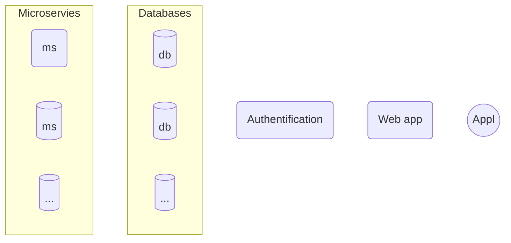

# Diagram d'activité

```mermaid
flowchart TB
    msAuth(Authentification)
    id(Web app)
    web((Appl))
  
    subgraph Microservies
    
    end
    subgraph Databases
    db[(db)]
    db1[(db)]
    db...[(...)]
    end
     
    subgraph Microservies
    ms(ms)
    ms1[(ms)]
    ms...[(...)]
    end
  

```