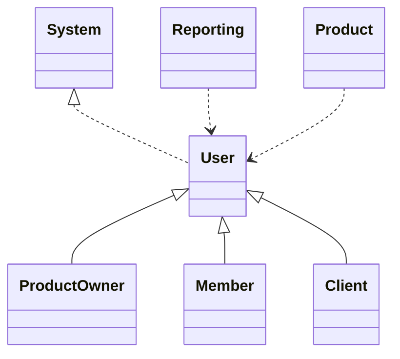
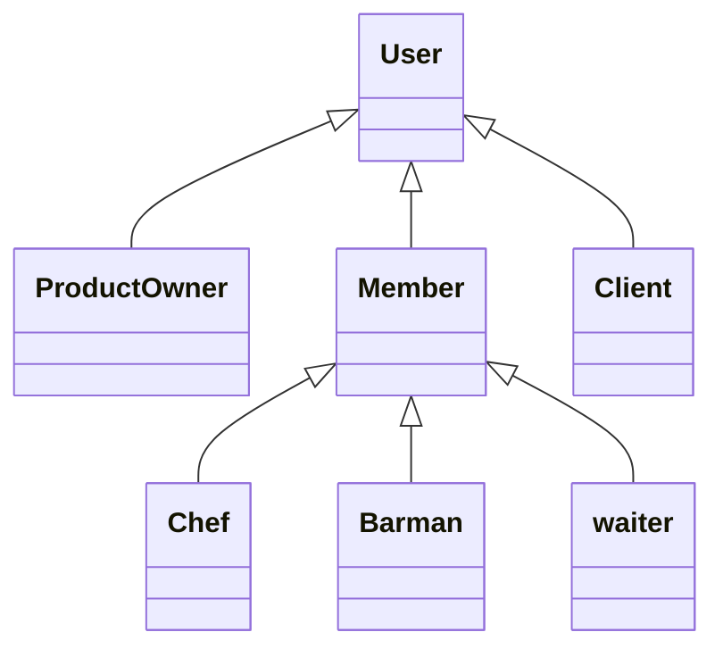
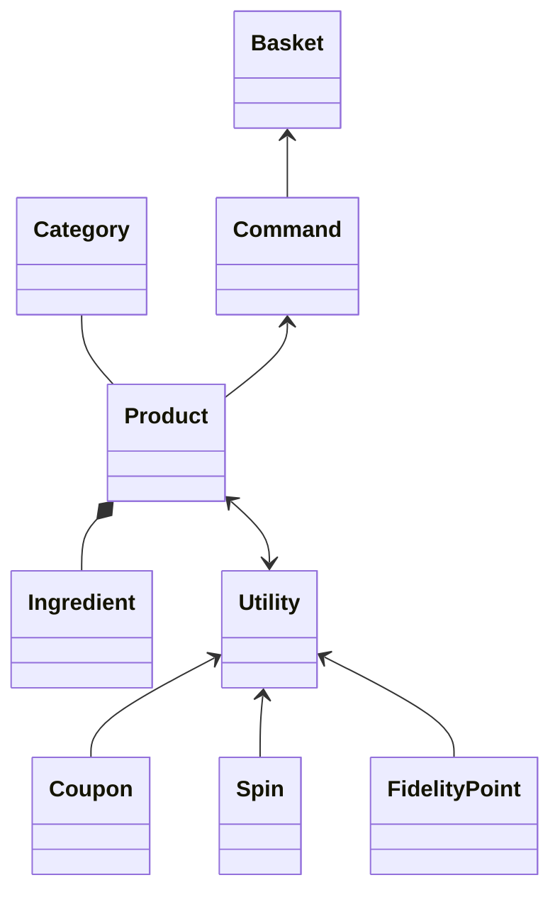
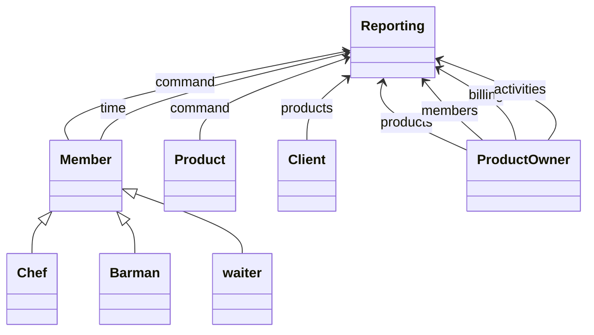

# Diagramme de class

## Root

```mermaid
%%    <|--	Inheritance
%%    \*--	Composition
%%    o--	Aggregation
%%    -->	Association
%%    --	Link (Solid)
%%    ..>	Dependency
%%    ..|>	Realization
%%    ..	Link (Dashed)
classDiagram 

   System  <|.. User 
   User <|-- ProductOwner
   User <|-- Member
   User <|-- Client
   Reporting ..> User 
   Product ..> User

```

&nbsp;

# Cas de restauration
## User

```mermaid
%%    <|--	Inheritance
%%    \*--	Composition
%%    o--	Aggregation
%%    -->	Association
%%    --	Link (Solid)
%%    ..>	Dependency
%%    ..|>	Realization
%%    ..	Link (Dashed)
classDiagram 

   User <|-- ProductOwner
   User <|-- Member

   User <|-- Client
   Member <|-- Chef
   Member <|-- Barman
   Member <|-- waiter

 

  

  

```
 &nbsp;

## Product

```mermaid
classDiagram 
  Basket <-- Command
  Category --  Product
  Product *-- Ingredient
  Command <-- Product

   Utility <-- Coupon
   Utility <-- Spin
   Utility <-- FidelityPoint
   Product <--> Utility
  
   

``` 

 &nbsp;

## Reporting

```mermaid
classDiagram 
  Reporting <-- Member : command
  Reporting <-- Member : time

  Reporting <-- Product : command
  Member <|-- Chef
  Member <|-- Barman
  Member <|-- waiter
 Reporting <-- Client : products
 Reporting <-- ProductOwner : products
 Reporting <-- ProductOwner : members
 Reporting <-- ProductOwner : billing
 Reporting <-- ProductOwner : activities

  
   

```