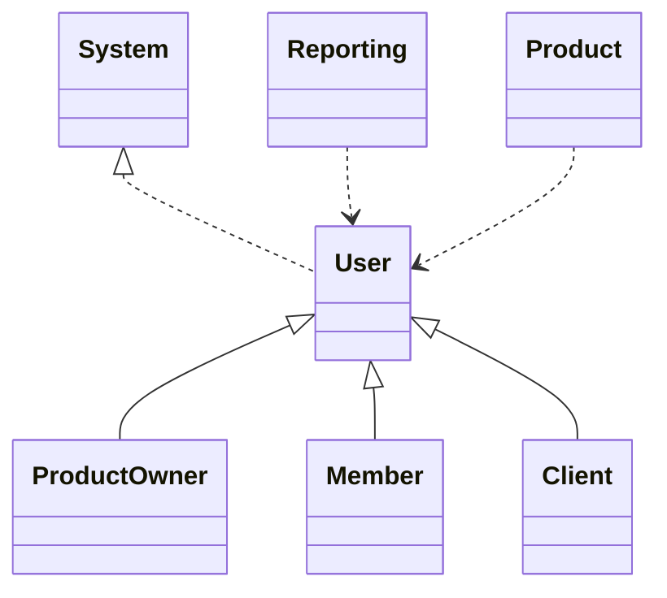

# Diagramme de class

## Root

```mermaid
%%    <|--	Inheritance
%%    \*--	Composition
%%    o--	Aggregation
%%    -->	Association
%%    --	Link (Solid)
%%    ..>	Dependency
%%    ..|>	Realization
%%    ..	Link (Dashed)
classDiagram 

   System  <|.. User 
   User <|-- ProductOwner
   User <|-- Member
   User <|-- Client
   Reporting ..> User 
   Product ..> User

    class User{

    }
    class ProductOwner{

    }

    class Member{

    }
    class Client{

    }
    class System{

    }
    class Reporting{

    }
    class Product{

    }

```

## User

```mermaid
%%    <|--	Inheritance
%%    \*--	Composition
%%    o--	Aggregation
%%    -->	Association
%%    --	Link (Solid)
%%    ..>	Dependency
%%    ..|>	Realization
%%    ..	Link (Dashed)
classDiagram 

   System  <|.. User 
   User <|-- ProductOwner
   User <|-- Member
   User <|-- Client
   Reporting ..> User 
   Product ..> User

    class User{

    }
    class ProductOwner{

    }

    class Member{

    }
    class Client{

    }
    
    class Reporting{

    }
    class Product{

    }

```