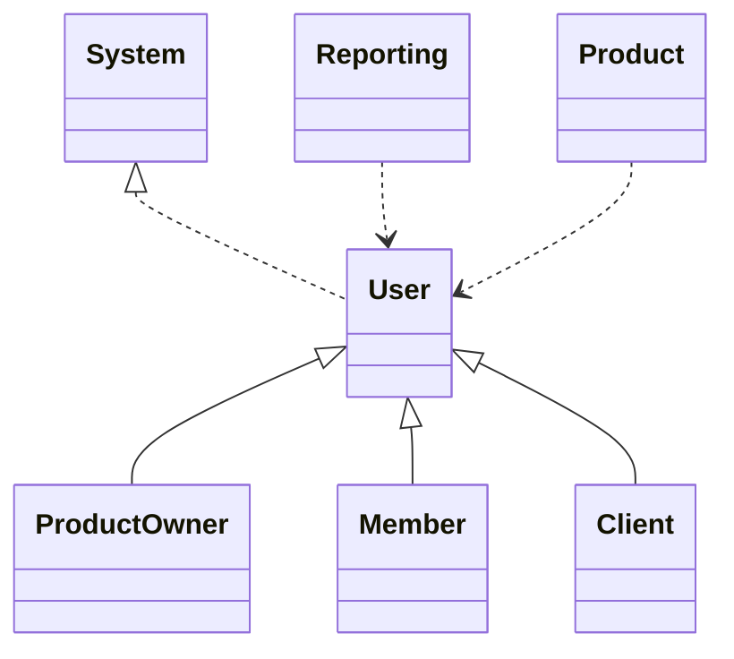
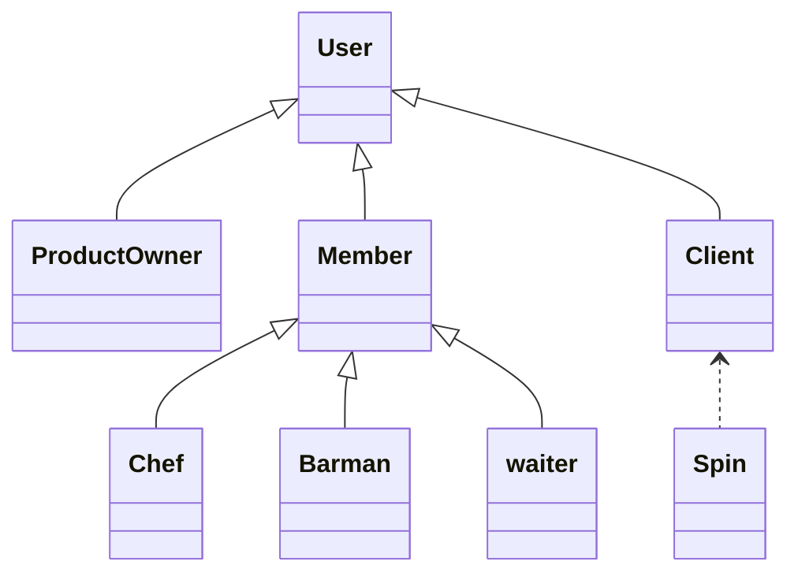
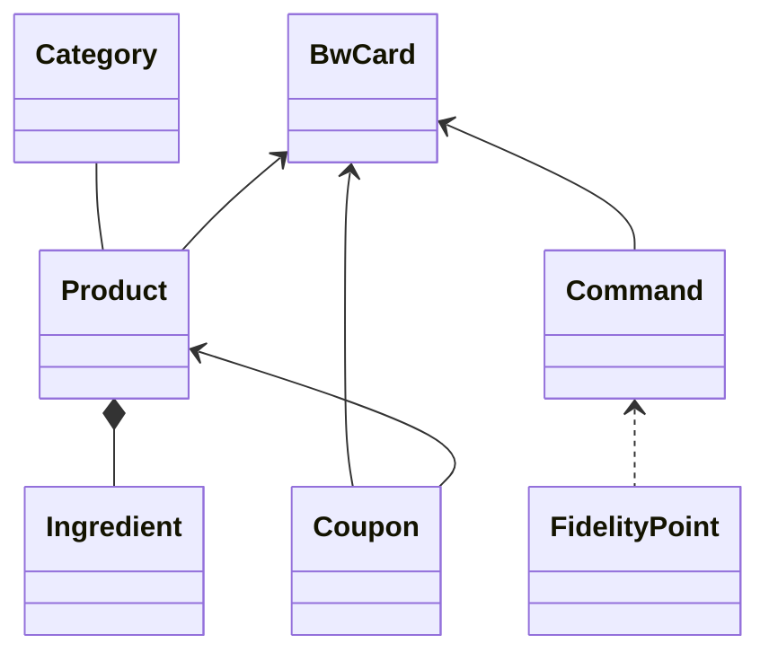
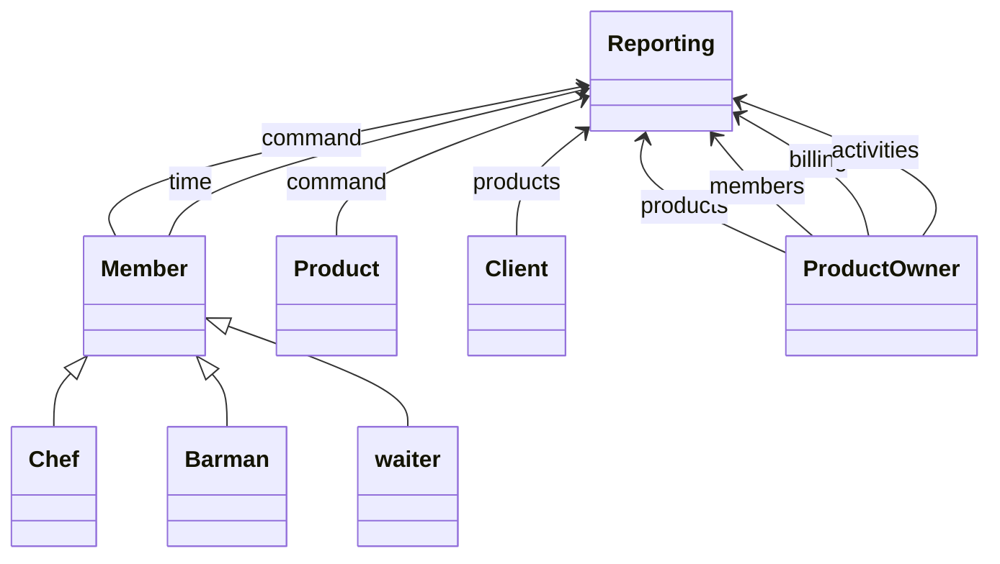

# Diagramme de class

## Root

```mermaid
%%    <|-- Inheritance
%%    \*-- Composition
%%    o-- Aggregation
%%    --> Association
%%    -- Link (Solid)
%%    ..> Dependency
%%    ..|> Realization
%%    .. Link (Dashed)
classDiagram 

   System  <|.. User 
   User <|-- ProductOwner
   User <|-- Member
   User <|-- Client
   Reporting ..> User 
   Product ..> User

```

&nbsp;

## Cas de réstauration

### User

```mermaid
%%    <|-- Inheritance
%%    \*-- Composition
%%    o-- Aggregation
%%    --> Association
%%    -- Link (Solid)
%%    ..> Dependency
%%    ..|> Realization
%%    .. Link (Dashed)
classDiagram 

   User <|-- ProductOwner
   User <|-- Member
   Client<..Spin
   User <|-- Client
   Member <|-- Chef
   Member <|-- Barman
   Member <|-- waiter

 

```

 &nbsp;

### Product

```mermaid
classDiagram 
  
  Category --  Product
  Product *-- Ingredient
  BwCard <-- Product
   BwCard<--Command
   BwCard<--Coupon
   Product <-- Coupon

   Command <.. FidelityPoint
  
  
   

```

 &nbsp;

### Reporting

```mermaid
classDiagram 
  Reporting <-- Member : command
  Reporting <-- Member : time

  Reporting <-- Product : command
  Member <|-- Chef
  Member <|-- Barman
  Member <|-- waiter
 Reporting <-- Client : products
 Reporting <-- ProductOwner : products
 Reporting <-- ProductOwner : members
 Reporting <-- ProductOwner : billing
 Reporting <-- ProductOwner : activities

  
   

```
